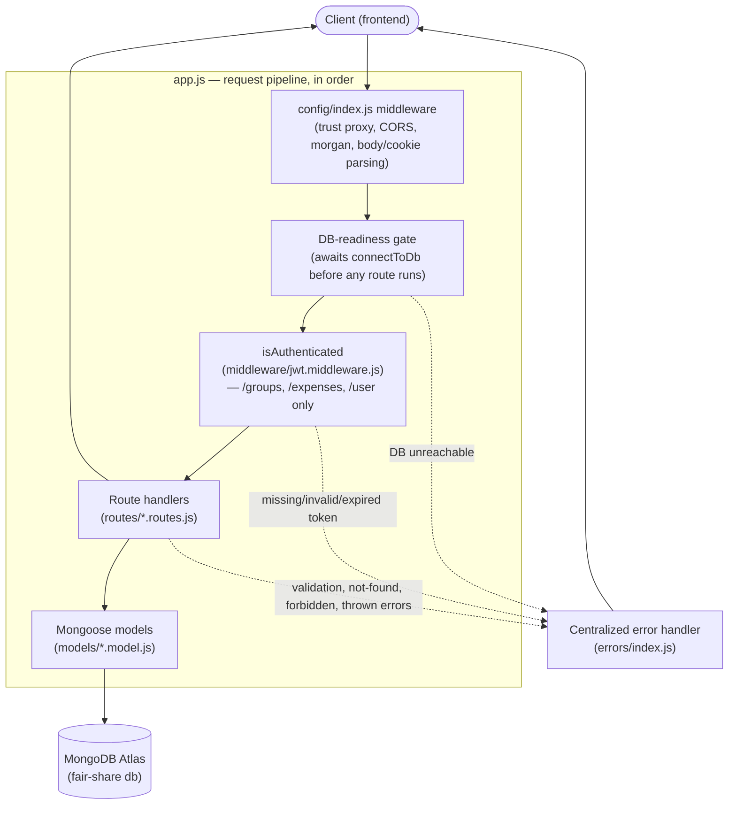
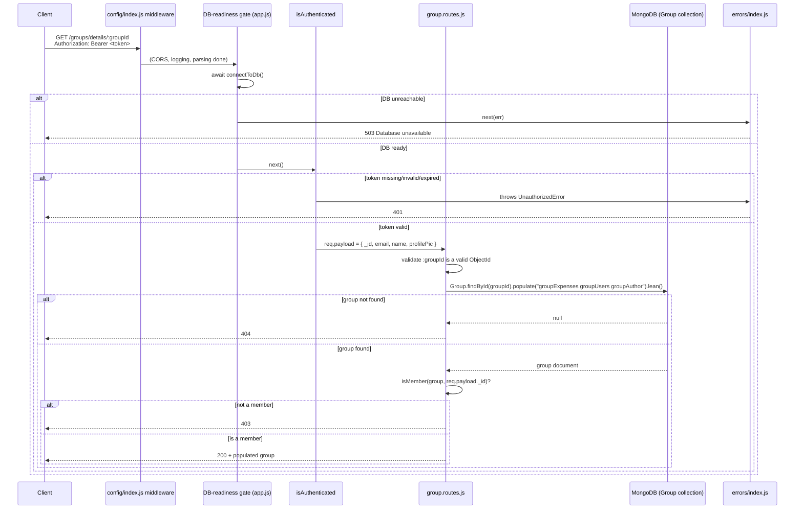
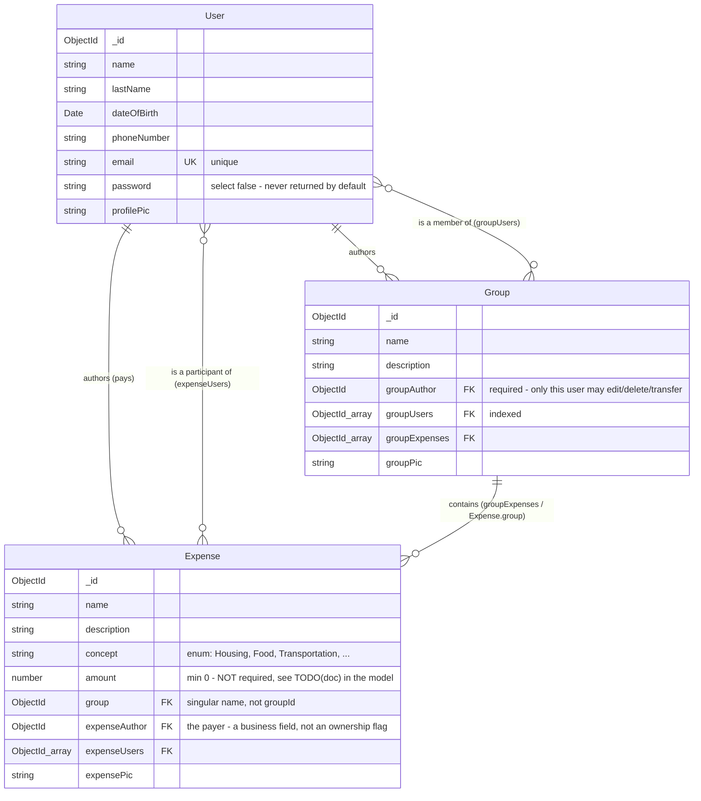

# Architecture

This document explains how `fair-share-server` fits together: the request pipeline, a concrete request walked end-to-end, the data model, the reasoning behind some non-obvious choices, and a map from "I want to change X" to the file that owns it. See [README.md](README.md) for setup, the full endpoint list, and request/response examples.

## System overview

Fair Share is a small Express + MongoDB API with three resources — **User**, **Group**, **Expense** — and JWT-based auth. There's no client code in this repository; a separate frontend (deployed at `https://app-fair-share.vercel.app`) is the only consumer of this API.

`/auth` (signup/login/verify) is the one router mounted **without** `isAuthenticated` — it's the only way to obtain a token, so it has to be reachable without one. Every other router (`/groups`, `/expenses`, `/user`) is gated.

## Request lifecycle: `GET /groups/details/:groupId`

This endpoint is a good representative example because it exercises nearly every layer: auth, the DB gate, a membership-based authorization check (not just "is this your own resource"), and a populated read.

## Data model

Note the asymmetry: **Group** authorization is member-vs-author (two tiers), but **Expense** authorization for reading/creating rides on the *group's* membership, not on `expenseAuthor` — see `callerMayAccess` in `expense.routes.js`.

## Key design decisions

Some of these are stated directly in code comments; others are inferred from the code's shape and marked as such.

- **`req.payload`, not `req.user`.** `middleware/jwt.middleware.js` configures express-jwt with `requestProperty: "payload"`. *(Explicit — visible in the middleware config itself.)*
- **`password: { select: false }` on the User schema**, rather than every route remembering to `.select("-password")`. One schema-level flag makes leaking a password hash structurally hard — it disappears from every query and populate by default, and `auth.routes.js`'s login is the one place that opts back in with `.select("+password")`. *(Inferred: this is a stronger guarantee than the alternative of scattering exclusions across routes, and the codebase consistently relies on it rather than re-adding manual exclusions.)*
- **A memoized connection promise in `db/index.js`**, instead of a plain `mongoose.connect()` call. This exists specifically for serverless hosting: a "warm" Vercel invocation reuses a frozen process, so re-running `connectToDb()` must resolve instantly rather than reconnect, while concurrent "cold" requests must share one in-flight attempt instead of racing. *(Explicit — the file's own header/comments state this.)*
- **DB unavailability is `503`, not `500`.** `errors/index.js` special-cases `MongooseServerSelectionError`/`MongoNetworkError`/a buffering timeout. *(Explicit — commented in errors/index.js: "a transient infrastructure fault, not a bug in the request.")*
- **Two authorization tiers per resource** (member vs. author) rather than one. Reading a Group/Expense only requires membership; changing or deleting one requires being the specific author. *(Inferred from the consistent pattern across `group.routes.js`/`expense.routes.js`: every handler either calls `isMember`/`callerMayAccess`, or does a direct `groupAuthor`/`expenseAuthor` equality check — never both loosely combined.)*
- **CORS is wide open (`origin: "*"`).** Safe specifically because auth is a Bearer token in a header, not a cookie — there's no ambient credential a cross-origin page could ride on. *(Explicit — commented in config/index.js.)*
- **Field whitelisting (`UPDATABLE_FIELDS` / `WRITABLE_FIELDS`)** on every create/update route, instead of passing `req.body` straight to Mongoose. Prevents a caller from setting fields like `groupAuthor` or `_id` via mass assignment. *(Explicit — commented at each constant's definition.)*

## Where do I look if I want to change X?

| I want to... | Look at |
|---|---|
| Add a new API endpoint | The relevant `routes/*.routes.js`, then confirm it's mounted (and gated correctly) in `app.js` |
| Change what's stored on a User/Group/Expense | The matching `models/*.model.js` |
| Change login/signup rules or token contents | `routes/auth.routes.js` |
| Change what counts as "authorized" for a resource | The `isMember`/`callerMayAccess`/author-equality checks in that resource's route file |
| Change error status codes or response shape | `errors/index.js` |
| Change CORS, logging, or body/cookie parsing | `config/index.js` |
| Change DB connection, timeouts, or retry behavior | `db/index.js` |
| Change deployment routing (Vercel) | `vercel.json` |
| Regenerate sample/test data | `utils/generateDummyData.js` (standalone script, not wired to any npm command) |
| Change lint rules | `eslint.config.js` |

## `TODO(doc)` — flagged during this documentation pass

- **`Expense.amount` has no `required: true`**, unlike every other core field on all three models. It's unclear whether an amount-less expense is an intentional draft/placeholder state or an oversight — flagged in `models/Expense.model.js` rather than assumed either way.
